Red wine quality analysis
=========================

Exploring which chemical properties influence the quality of red wines.

This tidy data set contains 1,599 red wines with 11 variables on the chemical properties of the wine. At least 3 wine experts rated the quality of each wine, providing a rating between 0 (very bad) and 10 (very excellent).

Description of attributes:

1 - fixed acidity: most acids involved with wine or fixed or nonvolatile (do not evaporate readily)

2 - volatile acidity: the amount of acetic acid in wine, which at too high of levels can lead to an unpleasant, vinegar taste

3 - citric acid: found in small quantities, citric acid can add 'freshness' and flavor to wines

4 - residual sugar: the amount of sugar remaining after fermentation stops, it's rare to find wines with less than 1 gram/liter and wines with greater than 45 grams/liter are considered sweet

5 - chlorides: the amount of salt in the wine

6 - free sulfur dioxide: the free form of SO2 exists in equilibrium between molecular SO2 (as a dissolved gas) and bisulfite ion; it prevents microbial growth and the oxidation of wine

7 - total sulfur dioxide: amount of free and bound forms of S02; in low concentrations, SO2 is mostly undetectable in wine, but at free SO2 concentrations over 50 ppm, SO2 becomes evident in the nose and taste of wine

8 - density: the density of water is close to that of water depending on the percent alcohol and sugar content

9 - pH: describes how acidic or basic a wine is on a scale from 0 (very acidic) to 14 (very basic); most wines are between 3-4 on the pH scale

10 - sulphates: a wine additive which can contribute to sulfur dioxide gas (S02) levels, winch acts as an antimicrobial and antioxidant

11 - alcohol: the percent alcohol content of the wine

Output variable (based on sensory data):

12 - quality (score between 0 and 10)

    ##   X fixed.acidity volatile.acidity citric.acid residual.sugar chlorides
    ## 1 1           7.4             0.70        0.00            1.9     0.076
    ## 2 2           7.8             0.88        0.00            2.6     0.098
    ## 3 3           7.8             0.76        0.04            2.3     0.092
    ## 4 4          11.2             0.28        0.56            1.9     0.075
    ## 5 5           7.4             0.70        0.00            1.9     0.076
    ## 6 6           7.4             0.66        0.00            1.8     0.075
    ##   free.sulfur.dioxide total.sulfur.dioxide density   pH sulphates alcohol
    ## 1                  11                   34  0.9978 3.51      0.56     9.4
    ## 2                  25                   67  0.9968 3.20      0.68     9.8
    ## 3                  15                   54  0.9970 3.26      0.65     9.8
    ## 4                  17                   60  0.9980 3.16      0.58     9.8
    ## 5                  11                   34  0.9978 3.51      0.56     9.4
    ## 6                  13                   40  0.9978 3.51      0.56     9.4
    ##   quality
    ## 1       5
    ## 2       5
    ## 3       5
    ## 4       6
    ## 5       5
    ## 6       5

    ## 'data.frame':    1599 obs. of  13 variables:
    ##  $ X                   : int  1 2 3 4 5 6 7 8 9 10 ...
    ##  $ fixed.acidity       : num  7.4 7.8 7.8 11.2 7.4 7.4 7.9 7.3 7.8 7.5 ...
    ##  $ volatile.acidity    : num  0.7 0.88 0.76 0.28 0.7 0.66 0.6 0.65 0.58 0.5 ...
    ##  $ citric.acid         : num  0 0 0.04 0.56 0 0 0.06 0 0.02 0.36 ...
    ##  $ residual.sugar      : num  1.9 2.6 2.3 1.9 1.9 1.8 1.6 1.2 2 6.1 ...
    ##  $ chlorides           : num  0.076 0.098 0.092 0.075 0.076 0.075 0.069 0.065 0.073 0.071 ...
    ##  $ free.sulfur.dioxide : num  11 25 15 17 11 13 15 15 9 17 ...
    ##  $ total.sulfur.dioxide: num  34 67 54 60 34 40 59 21 18 102 ...
    ##  $ density             : num  0.998 0.997 0.997 0.998 0.998 ...
    ##  $ pH                  : num  3.51 3.2 3.26 3.16 3.51 3.51 3.3 3.39 3.36 3.35 ...
    ##  $ sulphates           : num  0.56 0.68 0.65 0.58 0.56 0.56 0.46 0.47 0.57 0.8 ...
    ##  $ alcohol             : num  9.4 9.8 9.8 9.8 9.4 9.4 9.4 10 9.5 10.5 ...
    ##  $ quality             : int  5 5 5 6 5 5 5 7 7 5 ...

    ## [1] 5.636023

Since we are trying to find the relation between the independent variables and the quality of the wine, we are not interested in a specific wine, so I removed the unneeded X column. Also, I changed the data type of the quality variable to Factor instead of int as it is a categorical variable not a continuous variable, this will make functions treat it appropriately, like in the ggpairs function for example. Before changing the quality to factor I calculated the mean to get an idea about the numerical average of the quality, which in this case is equal to 5.636023.

Univariate Plots Section
------------------------

    ##  fixed.acidity   volatile.acidity  citric.acid    residual.sugar  
    ##  Min.   : 4.60   Min.   :0.1200   Min.   :0.000   Min.   : 0.900  
    ##  1st Qu.: 7.10   1st Qu.:0.3900   1st Qu.:0.090   1st Qu.: 1.900  
    ##  Median : 7.90   Median :0.5200   Median :0.260   Median : 2.200  
    ##  Mean   : 8.32   Mean   :0.5278   Mean   :0.271   Mean   : 2.539  
    ##  3rd Qu.: 9.20   3rd Qu.:0.6400   3rd Qu.:0.420   3rd Qu.: 2.600  
    ##  Max.   :15.90   Max.   :1.5800   Max.   :1.000   Max.   :15.500  
    ##    chlorides       free.sulfur.dioxide total.sulfur.dioxide
    ##  Min.   :0.01200   Min.   : 1.00       Min.   :  6.00      
    ##  1st Qu.:0.07000   1st Qu.: 7.00       1st Qu.: 22.00      
    ##  Median :0.07900   Median :14.00       Median : 38.00      
    ##  Mean   :0.08747   Mean   :15.87       Mean   : 46.47      
    ##  3rd Qu.:0.09000   3rd Qu.:21.00       3rd Qu.: 62.00      
    ##  Max.   :0.61100   Max.   :72.00       Max.   :289.00      
    ##     density             pH          sulphates         alcohol      quality
    ##  Min.   :0.9901   Min.   :2.740   Min.   :0.3300   Min.   : 8.40   3: 10  
    ##  1st Qu.:0.9956   1st Qu.:3.210   1st Qu.:0.5500   1st Qu.: 9.50   4: 53  
    ##  Median :0.9968   Median :3.310   Median :0.6200   Median :10.20   5:681  
    ##  Mean   :0.9967   Mean   :3.311   Mean   :0.6581   Mean   :10.42   6:638  
    ##  3rd Qu.:0.9978   3rd Qu.:3.400   3rd Qu.:0.7300   3rd Qu.:11.10   7:199  
    ##  Max.   :1.0037   Max.   :4.010   Max.   :2.0000   Max.   :14.90   8: 18

The first observation from the summary of the variables is that the quality of the wines only varies between 3 to 8 with the majority being ranked as 5 or 6. The second observation is that some of the other variables like residual.sugar and chlorides have a relatively large Max compared to the Median, this indicates that there might be some outliers.

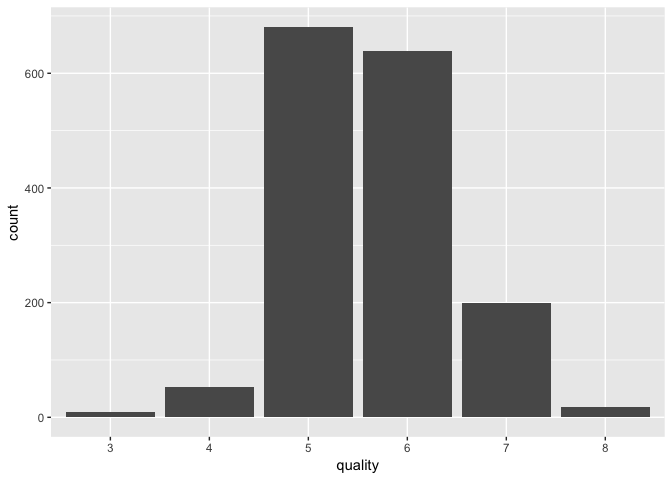

The visual representation of the distribution of the quality variable is aligned with the summary, the quality of the wines only varies between 3 to 8 with the majority being ranked as 5 or 6.

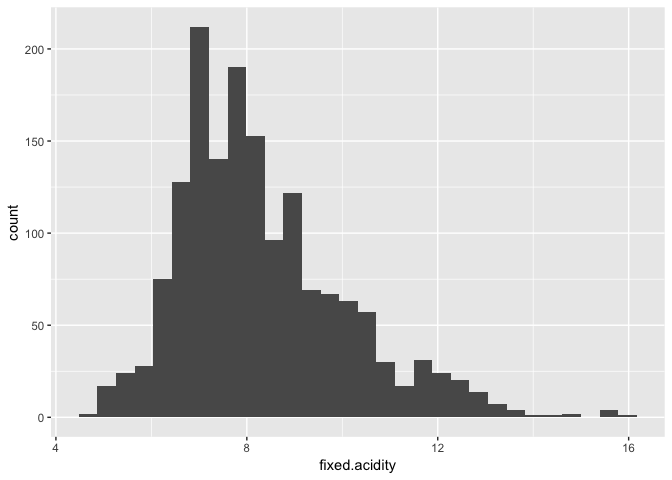

The above histogram shows that the data is skewed to the right.

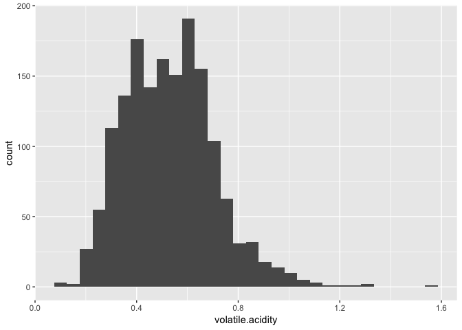

The above histogram shows that the data is skewed to the right.

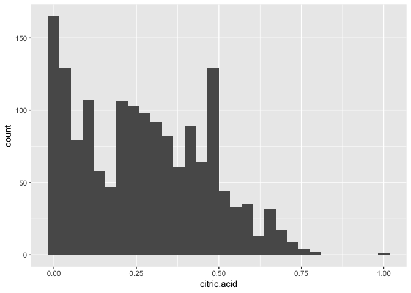

The above histogram shows that the data is skewed to the right.

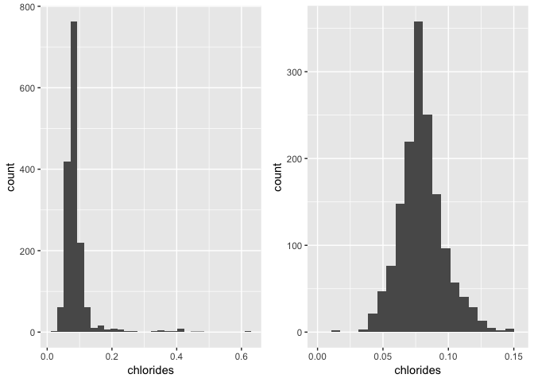

The above histogram shows that the chlorides data is somehow normally distributed with some outliers on the right, as the case with most of the independent variables the plot shows that if we remove the top few % of the chlorides variable it becomes more and more normally distributed, specifically after removing the top 4%. The same applies for the other variables with outliers.

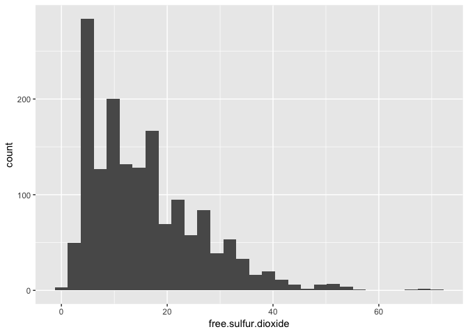

The above histogram shows that the data is skewed to the right.

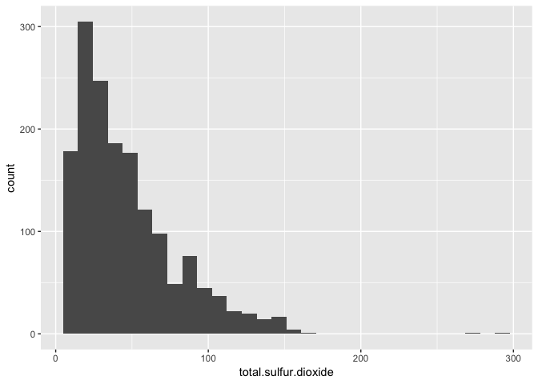

The above histogram shows that the data is skewed to the right.

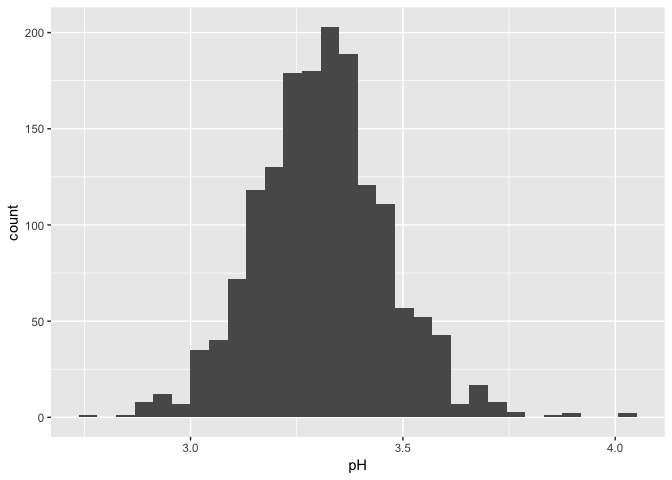

The above histogram shows that the pH is somehow normally distributed with some outliers on the right.

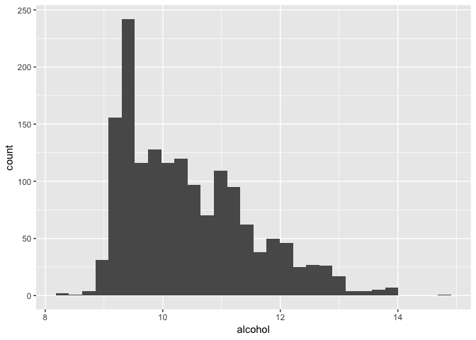

The above histogram shows that the data is skewed to the right.

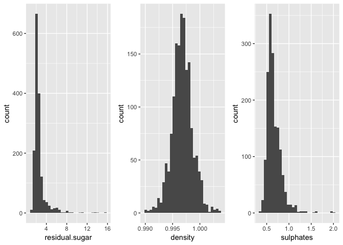

The above plots show the distribution of all the dependent variables and it is clear that most of them are normally distributed with some being skewed to the right. It is also clear that as previously inferred from the summary, there are some outliers in some of the variables.

### Univariate Analysis

#### What is the structure of your dataset?

The data contains 11 independent variables and 1 dependent variable which is the quality. There are 1599 observations in the dataset with no missing values. The independent variables are continuous and have a data type of num, while the dependent variable is discrete and I changed its data type from int to Factor.

#### What is the main feature of interest in your dataset?

The main feature of interest is the dependent variable which is the quality.

#### What other features in the dataset do you think will help support your investigation into your feature(s) of interest?

The independent variables will be the driving our model for the quality. In the next sections will investigate the relationship between them.

#### Did you create any new variables from existing variables in the dataset?

No.

#### Of the features you investigated, were there any unusual distributions?
Did you perform any operations on the data to tidy, adjust, or change the form of the data? If so, why did you do this?

Most of them are normally distributed with some being skewed to the right. It is also clear that as previously inferred from the summary, there are some outliers in some of the variables.

As for operations on the data, I changed the data type of the quality variable to Factor instead of int as it is a categorical variable not a continuous variable, this will make functions treat it appropriately, like in the ggpairs function for example.

Bivariate Plots Section
-----------------------

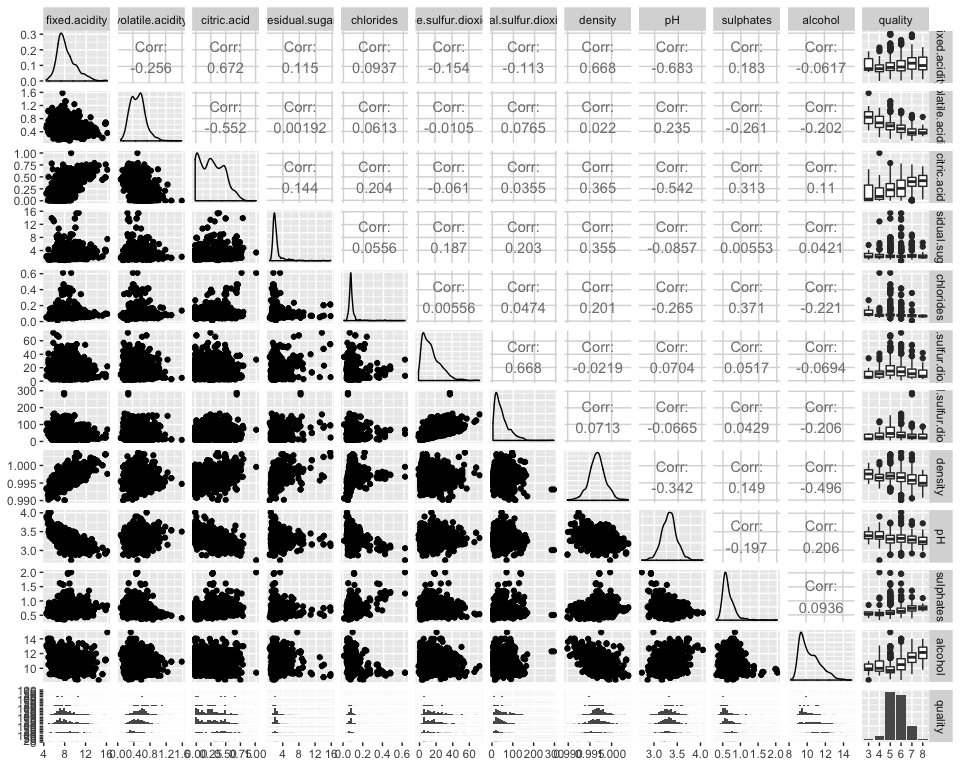

To start of the bivariate exploration, I generated the ggpairs plot to visualize all the relationships between the variables. As you can see the quality column is showing box plots as now it is treated as a categorical variable after changing it to a factor. There are some correlations in between the independent variables, and more importantly there are some trends in the box plots of the quality column that need further exploration.

Will start of by exploring the relationships between the independent variables. The first thing that I noticed is the relatively high correlations between the acidity variables (fixed.acidity, volatile.acidity, citric.acid)

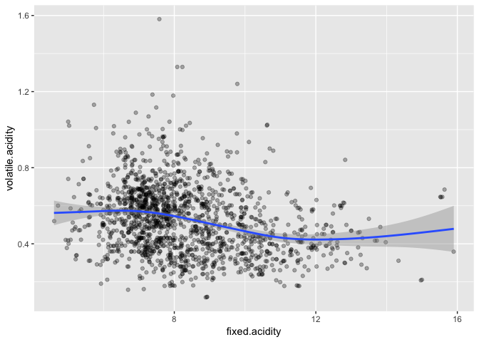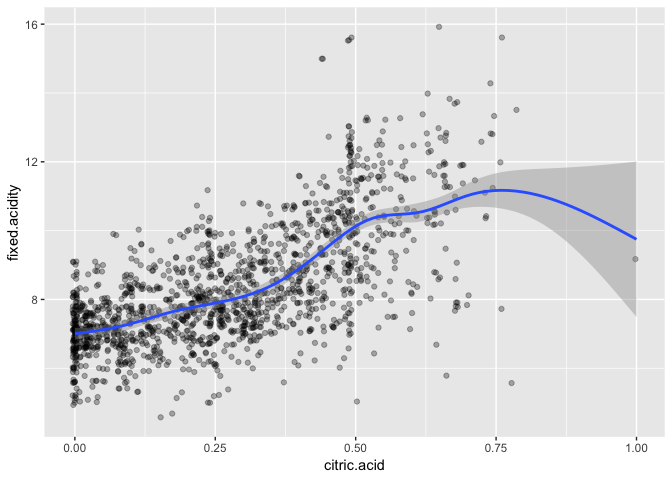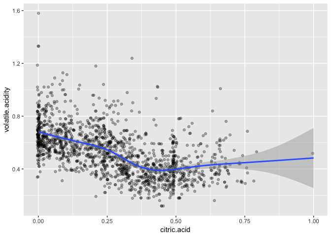

    ## 
    ##  Pearson's product-moment correlation
    ## 
    ## data:  fixed.acidity and volatile.acidity
    ## t = -10.589, df = 1597, p-value < 2.2e-16
    ## alternative hypothesis: true correlation is not equal to 0
    ## 95 percent confidence interval:
    ##  -0.3013681 -0.2097433
    ## sample estimates:
    ##        cor 
    ## -0.2561309

    ## 
    ##  Pearson's product-moment correlation
    ## 
    ## data:  fixed.acidity and citric.acid
    ## t = 36.234, df = 1597, p-value < 2.2e-16
    ## alternative hypothesis: true correlation is not equal to 0
    ## 95 percent confidence interval:
    ##  0.6438839 0.6977493
    ## sample estimates:
    ##       cor 
    ## 0.6717034

    ## 
    ##  Pearson's product-moment correlation
    ## 
    ## data:  volatile.acidity and citric.acid
    ## t = -26.489, df = 1597, p-value < 2.2e-16
    ## alternative hypothesis: true correlation is not equal to 0
    ## 95 percent confidence interval:
    ##  -0.5856550 -0.5174902
    ## sample estimates:
    ##        cor 
    ## -0.5524957

From the above 3 plots it is clear that there are some relationships between these variables. The correlation between the the fixed and volatile acidity is not as strong as the correlation between each of them and the citric acid. But this is just in terms of the strength of the correlation, because in terms of the direction, the fixed acidity is positively correlated while the volatile acidity is negatively correlated. Also, the correlation with the fixed acidity is stronger than the correlation with the volatile acidity. As for the last observation, both these the correlations become weaker with higher levels of citric acid.

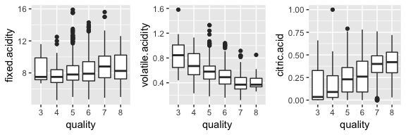

From the box plots above it seems that the fixed acidity is relatively a weak factor when it comes to affecting the quality. As for volatile acidity and citric acid, there are negative and positive respective patterns clear when it comes to the quality of wines, also both these patterns become weaker the better the quality gets.

    ## # A tibble: 6 x 6
    ##   quality mean_alcohol median_alcohol min_alcohol max_alcohol     n
    ##   <fct>          <dbl>          <dbl>       <dbl>       <dbl> <int>
    ## 1 3               9.96           9.93         8.4        11      10
    ## 2 4              10.3           10            9          13.1    53
    ## 3 5               9.90           9.7          8.5        14.9   681
    ## 4 6              10.6           10.5          8.4        14     638
    ## 5 7              11.5           11.5          9.2        14     199
    ## 6 8              12.1           12.2          9.8        14      18

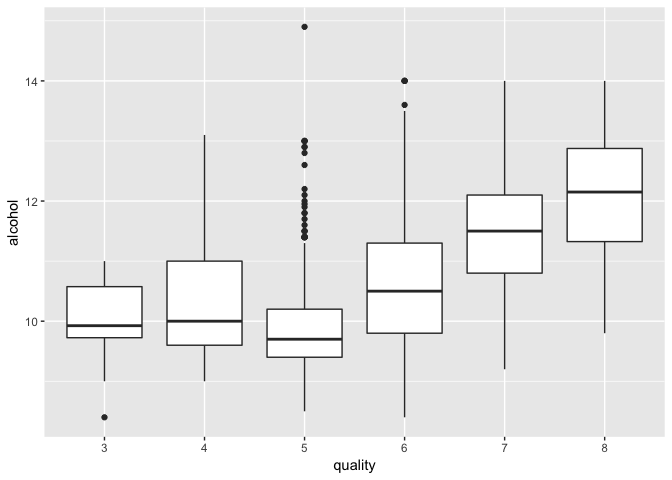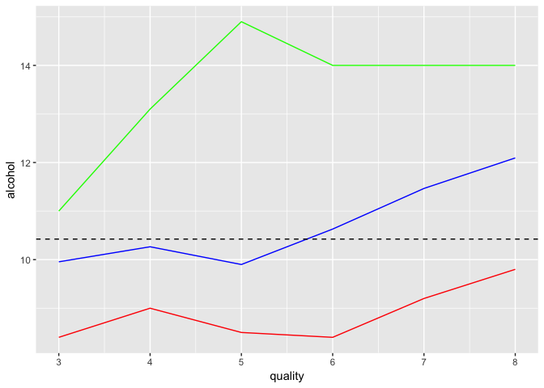

Based on the summaries and plots of the relationship between alcohol and quality above there seems to be a pattern between them. From the box plots it is clear that the higher the median of the alcohol the better the quality is, this pattern is true except for the quality value of 5, but it seems that this quality level has the most outliers. From the second line plot it is clear that these outliers pulled the mean a bit higher than the median, but still it doesn't follow the same pattern observed for the other quality values. Another observation, is the the maximum alcohol level for the top 3 values is 14% which might be an industry standard for higher quality wines.

Other general trends between quality and the independent variables can be identified from the box plots below, usual properties of better quality wines are listed below each plot.

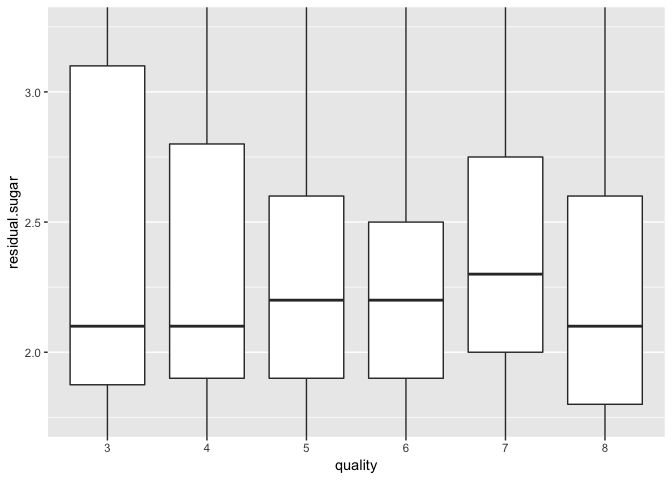

Residual sugar: no clear relation

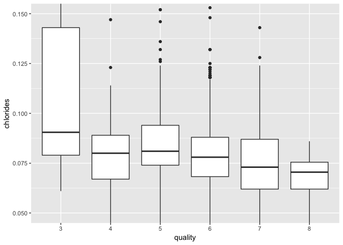

Chlorides: the less the better

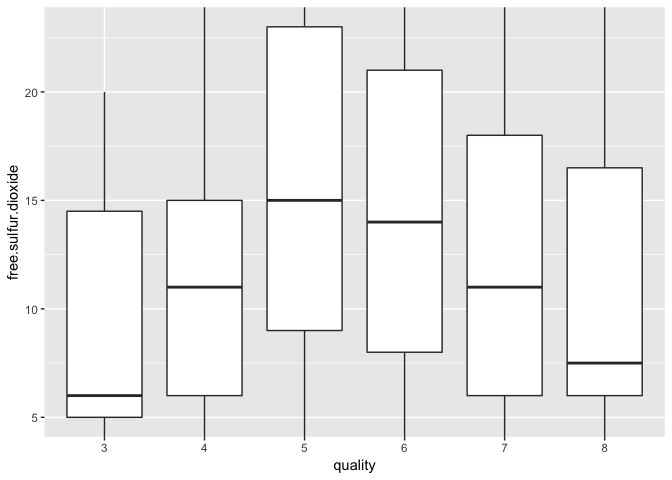

Free sulfur dioxide: none linear relation

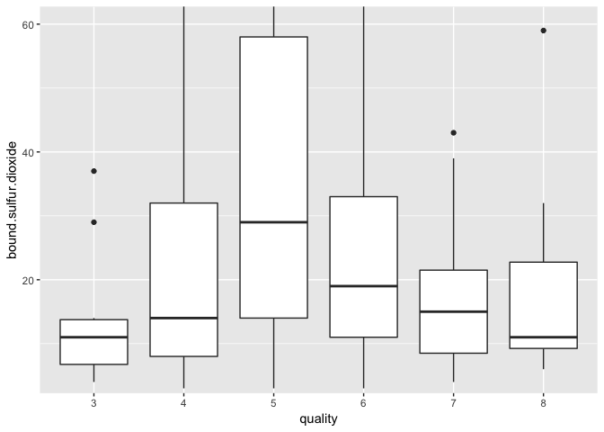

Bound sulfur dioxide: none linear relation

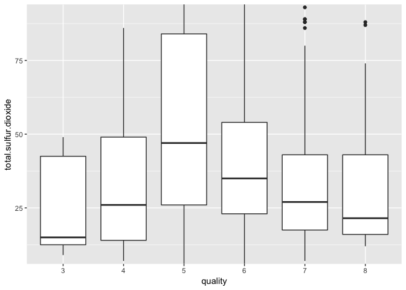

Total sulfur dioxide: none linear relation

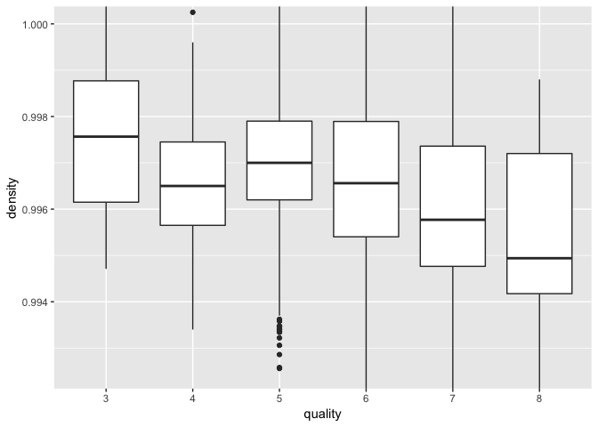

Density: the less the better

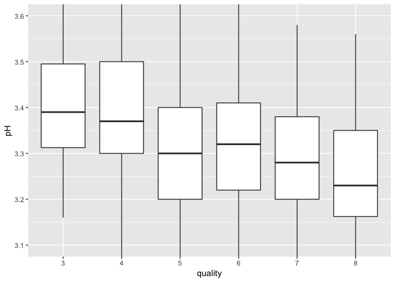

pH: the less the better

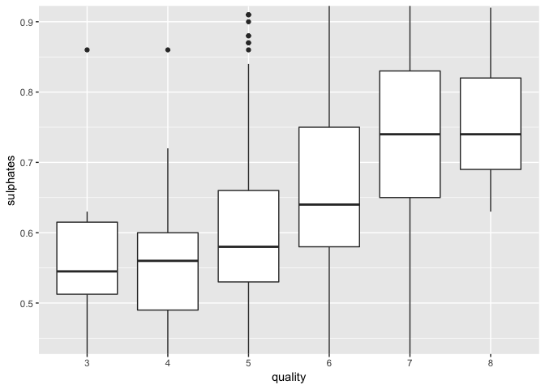

Sulphates: the more the better

### Bivariate Analysis

After exploring the relationship between all the features and the quality, also some of the relationships in between the independent variables here is a summary of what I observed.

There are some linear and non-linear trends between the quality and the other features.

An interesting observation was the related to analyzing the acidity variables, there are correlations between fixed and volatile acidity with the citric acid. After doing some online research I found out that citric acid is a type of fixed acids, but further research in the data documentation, I found out that even though citric acid is considered a fixed acid, in this dataset, the fixed acid is only representing tartaric acid. These observations show how important it is to have domain knowledge about the topic you are trying to analyze, and a reminder that correlation is not always related to causation. Further analysis might in the multivariant section might uncover more details.

Below is a summary of trends between quality and the independent variables: \* Fixed acidity: no clear relation \* Volatile acidity: the less the better \* Citric acid: the more the better \* Alcohol: the more the better \* Residual sugar: no clear relation \* Chlorides: the less the better \* Free sulfur dioxide: non-linear relation \* Bound sulfur dioxide: non-linear relation \* Total sulfur dioxide: non-linear relation \* Density: the less the better \* pH: the less the better \* Sulphates: the more the better

Multivariate Plots Section
--------------------------

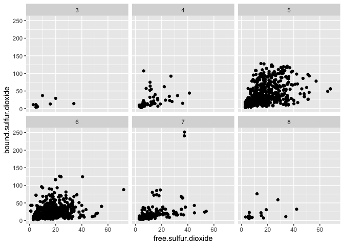

Exploring the relationship between the free and bound sulfur dioxide by different quality levels confirms that it is a non-liner relationship between the quality and sulfur dioxide, as it is clear that the pattern from the highest quality is quite similar to the lowest quality.

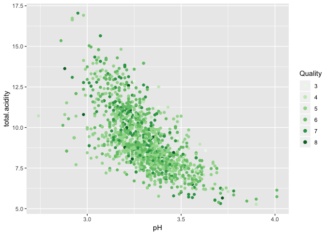

From the above plot it is clear that there is a relationship strong negative correlation between the total acidity and the pH as we would expect, but there are no clear patterns of any correlation with the quality of the wines.

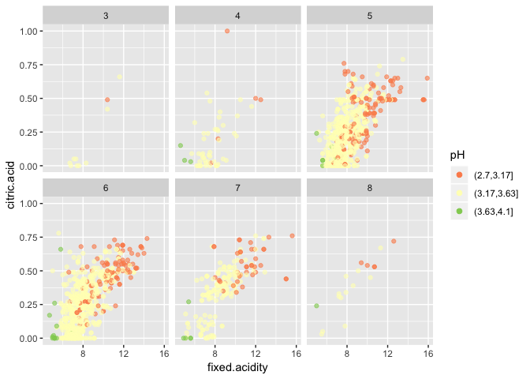

Further analysis shows that there are correlations between citric acid, fixed acidity and pH for all quality levels. This information will be useful in avoiding having more than one of them in the modeling part to avoid issues.

    ## 
    ## Call:
    ## glm(formula = quality ~ volatile.acidity + chlorides + total.sulfur.dioxide + 
    ##     density, family = binomial, data = rw)
    ## 
    ## Deviance Residuals: 
    ##     Min       1Q   Median       3Q      Max  
    ## -3.5947   0.0212   0.0415   0.0807   1.2132  
    ## 
    ## Coefficients:
    ##                        Estimate Std. Error z value Pr(>|z|)    
    ## (Intercept)           487.03180  187.91669   2.592  0.00955 ** 
    ## volatile.acidity       -7.34560    1.52277  -4.824 1.41e-06 ***
    ## chlorides              -9.35988    3.70543  -2.526  0.01154 *  
    ## total.sulfur.dioxide    0.04207    0.02000   2.103  0.03543 *  
    ## density              -478.80713  187.89867  -2.548  0.01083 *  
    ## ---
    ## Signif. codes:  0 '***' 0.001 '**' 0.01 '*' 0.05 '.' 0.1 ' ' 1
    ## 
    ## (Dispersion parameter for binomial family taken to be 1)
    ## 
    ##     Null deviance: 121.428  on 1598  degrees of freedom
    ## Residual deviance:  80.397  on 1594  degrees of freedom
    ## AIC: 90.397
    ## 
    ## Number of Fisher Scoring iterations: 9

The logistic model above shows that volatile.acidity, chlorides, total.sulfur.dioxide and density have significant p values.

### Multivariate Analysis

From the plots it is clear that some of the independent variables are correlated to each other which is something I had to consider when building the model, but none of the interactions showed a significantly higher effect on the quality of the wines.

My choice of having a logistic regression model over a linear regression is for 2 reasons, the first one is the fact that the quality variable is not a continuous variable, the second reason would be that the data is not equally distributed between the different quality levels. On the other hand, using this logistic regression model has it's drawbacks, the above model discards the fact the this is an ordinal variable.

The logistic model shows that volatile.acidity, chlorides, total.sulfur.dioxide and density variables have significant p values.

------------------------------------------------------------------------

Final Plots and Summary
-----------------------

### Plot One

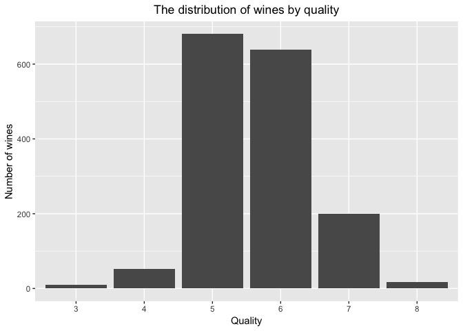

### Description One

The visual representation of the distribution of the quality variable seems to be normally distributed, the quality of the wines only varies between 3 to 8 with the majority being ranked as 5 or 6, but this isn't always a good thing. In our case there is an unequal representation of the different wine qualities in this dataset, this will negatively affect the accuracy of our model. Also the model will not be able to predict the part of the scale that is not represented in this dataset.

### Plot Two

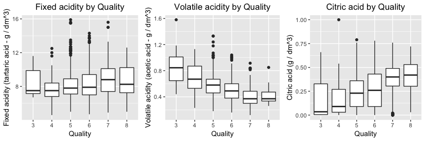

### Description Two

From the box plots above it seems that the fixed acidity is relatively a weak factor when it comes to affecting the quality. As for volatile acidity and citric acid, there are negative and positive respective patterns clear when it comes to the quality of wines, also both these patterns become weaker the better the quality gets.

An interesting observation regarding the correlations between fixed and volatile acidity with the citric acid is that after doing some online research I found out that citric acid is a type of fixed acids, but further research in the data documentation, I found out that even though citric acid is considered a fixed acid, in this dataset, the fixed acid is only representing tartaric acid. These observations show how important it is to have domain knowledge about the topic you are trying to analyze, and a reminder that correlation is not always related to causation.

### Plot Three

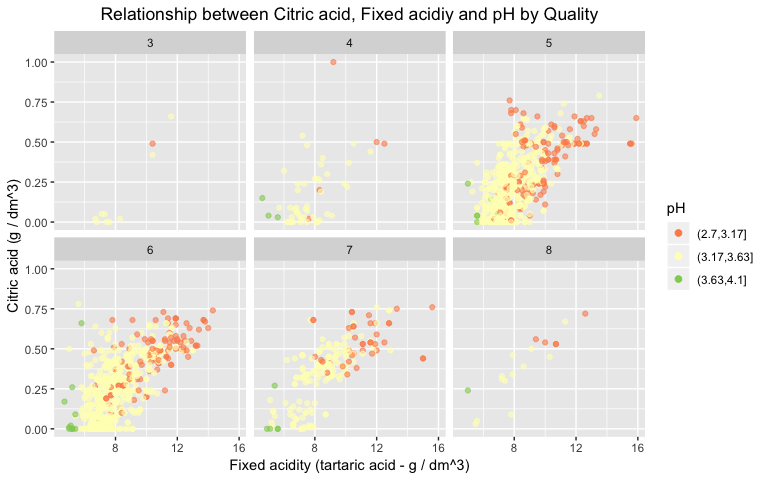

### Description Three

This plot shows that there are correlations between citric acid, fixed acidity and pH for all quality levels. These correlations between the independent variables can cause issues with the quality of the models in case we include more than one of them. This information was considered when creating the logistic model.

------------------------------------------------------------------------

Reflection
----------

Reflecting on the exploration, it think this dataset needs to be of better quality to have a more accurate model. Different wine qualities should be equally represented including the missing ones, or at least the scale should be modified. Also, another issue might be that there are differences between the experts grading the wines that can cause some of the observed effects.

The struggle I went through in the beginning was not having domain knowledge about the wine chemical properties, but after some research I was able to get a high level overview of the different properties and their effects on the quality, this helped drastically in understanding a lot of the relationships between all of the variables.

An example of future work with this data can be changing the quality variable from the median to the mean of the different experts, this can give a continuous variable that can be better represented with a linear model. Another thing would be having a better representation of the different wine qualities and updating the scale.
